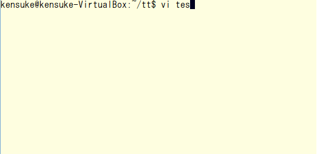

# tt-test
tt-testは、C言語用のxUnitテストフレームワークです。

小規模で、テストファーストの学習用に向いています。

対応コンパイラは、gcc2.7以降、Clang、vc2008以降です。

## 特徴
* テスト名に日本語が使えます。
* テストケースの登録は自動で行われます。
* 100行未満のヘッダファイルひとつのシンプルな構成です。

## サンプル


## 使い方
### 1. tt-test.hをダウンロードしてください。


### 2. プロダクトコードを用意してください。
例: calc.c
```c
int add(int lval, int rval) {
	return lval + rval;
}
```

例: calc.h
```c
#ifndef CALC_H
#define CALC_H

int add(int, int);

#endif
```

例: main.c
```c
#include <stdio.h>
#include <stdlib.h>
#include "calc.h"

int main(int argc, char *argv[]) {
	printf("%d\n", add(atoi(argv[1]), atoi(argv[2])));
	return 0;
}
```

### 3. テストコードを用意してください。
例: test_calc.c
```c
#include "tt-test.h"
#include "calc.h"

static void setup(void) {}
static void teardown(void) {}

TEST("add() 典型値の加算結果が不正です") {
	assert_equal(3, add(1, 2));
}

int main(void) {
	return run_all_tests();
}
```

tt-test.hのコメント内にテンプレートがあります。

テストケースは1ファイル内に1024件まで作成可能です。

各テストケースの実行前後にsetup(), teardown()が実行されます。

### 4. Makefileを用意してください。
例: Makefile
```Makefile
calc: calc.o main.o
	gcc $^ -o $@

test: calc.o test_calc.o
	gcc $^ -o $@
	./test
```

### 5. makeしてください。
```
$ make test -s
test_calc.c: 1/1 passed
```

## ライセンス
本ソフトウェアはPublic Domainです。

利用・改変・販売・配布に対して一切の制約を設けません。
