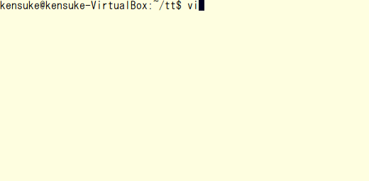

# tt-test
tt-test is xUnit testing framework for C.

This framework is tiny and suitable for learning test.

GCC2.7 and later, Clang, VC2008 and later are available.

## Feature
* Available multiple languages for test case name.
* Automated registration system for test cases.
* Simple structure containing just one .h file about 100 lines.

## Sample


## How to use
### 1. Download tt-test.h


### 2. Prepare product code
e.g.: calc.c
```c
int add(int lval, int rval) {
	return lval + rval;
}
```

e.g.: calc.h
```c
#ifndef CALC_H
#define CALC_H

int add(int, int);

#endif
```

e.g.: main.c
```c
#include <stdio.h>
#include <stdlib.h>
#include "calc.h"

int main(int argc, char *argv[]) {
	printf("%d\n", add(atoi(argv[1]), atoi(argv[2])));
	return 0;
}
```

### 3. Prepare test code
e.g.: test_calc.c
```c
#include "tt-test.h"
#include "calc.h"

static void setup(void) {}
static void teardown(void) {}

TEST("add() failed for typical input") {
	assert_equal(3, add(1, 2));
}

int main(void) {
	return run_all_tests();
}
```

tt-test.h has test template in the comment.

1024 test cases are available in one test file.

setup() and teardown() can be executed before and after each test case.

### 4. Prepare Makefile
e.g.: Makefile
```Makefile
calc: calc.o main.o
	gcc $^ -o $@

test: calc.o test_calc.o
	gcc $^ -o $@
	./test
```

### 5. Try make
```
$ make test -s
test_calc.c: 1/1 passed
```

## License
This source code is available under a Public Domain.

Anyone is free to use, modify, sell or distribute this software.

